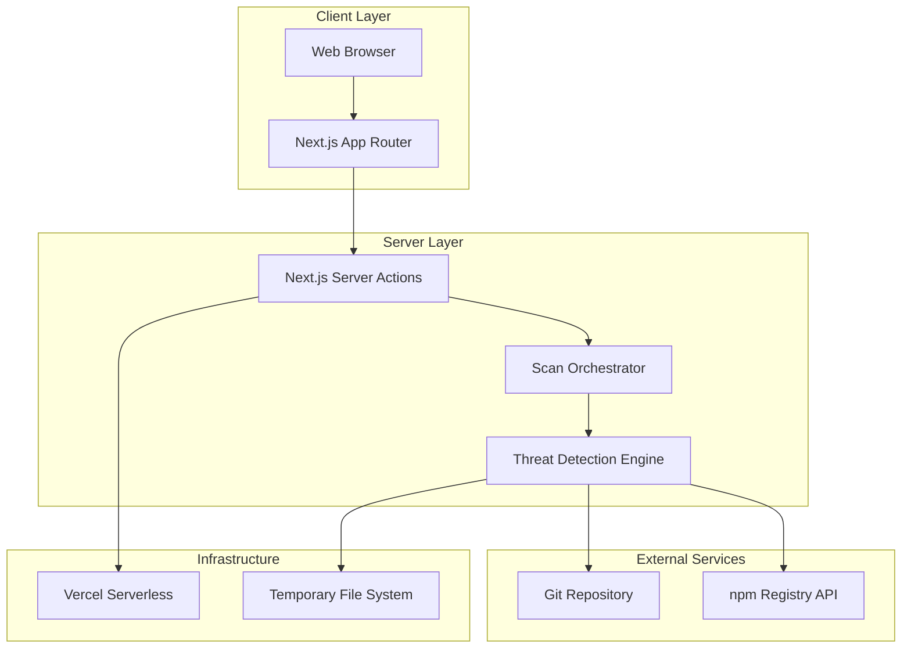
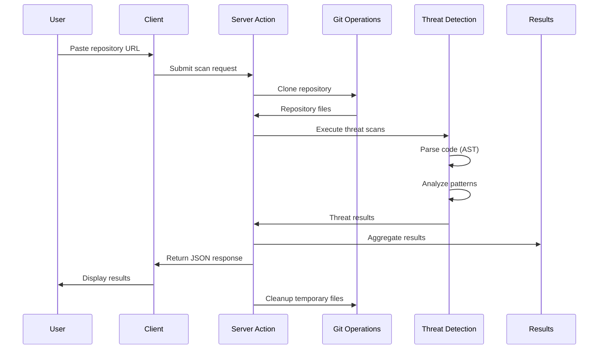
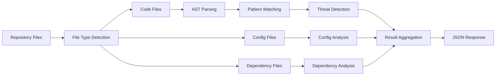

# repoHack Technical Architecture

## Executive Summary

**System Overview**: repoHack is a monolithic Next.js 14+ application that provides instant repository security scanning through a web-based interface. The system clones Git repositories, performs comprehensive threat analysis using AST-based code parsing, and returns structured security results within 15 seconds.

**Architecture Pattern**: Monolithic Next.js application with server actions for scanning operations, deployable on Vercel with stateless, serverless architecture.

**Key Technical Decisions**:
- Next.js 14+ with app directory structure for modern React patterns
- Server actions with "use server" directive for scanning operations
- AST-based code analysis for threat detection
- Temporary file system operations with automatic cleanup
- No database or persistent storage for MVP

## System Architecture

### High-Level Architecture



### Core Components

**1. Client Layer**
- Single-page React application with Next.js App Router
- Dark theme UI using Tailwind CSS and Fira Mono font
- Repository URL input form and adaptive results display
- Responsive design for desktop and mobile devices

**2. Server Layer**
- Next.js server actions handling scanning operations
- Scan orchestrator coordinating multi-step threat detection
- Individual threat detection modules for each security category
- Result aggregation and JSON formatting

**3. External Integrations**
- Git operations using simple-git library
- npm registry API for dependency analysis
- No authentication or external security services required

**4. Infrastructure**
- Next.js backend deployment (Vercel, Netlify, or custom hosting)
- Temporary file system for repository cloning
- Automatic cleanup after each scan

## Technical Stack

### Frontend Technologies
- **Framework**: Next.js 14+ with App Router
- **Language**: TypeScript for type safety
- **Styling**: Tailwind CSS for utility-first styling
- **Fonts**: Fira Mono (monospace) for code elements, Inter for UI text
- **Icons**: Lucide React for consistent iconography
- **State Management**: React hooks and server actions

### Backend Technologies
- **Runtime**: Node.js (Vercel serverless)
- **Git Operations**: simple-git for repository cloning
- **Code Parsing**: @typescript-eslint/parser for AST generation
- **File Processing**: Node.js fs module for file operations
- **HTTP Client**: Built-in fetch API for npm registry calls

### Development Tools
- **Package Manager**: pnpm
- **Linting**: ESLint with TypeScript support
- **Code Formatting**: Prettier
- **Git Hooks**: Husky (optional for MVP)

## Data Flow Architecture

### Repository Scanning Flow



### Threat Detection Pipeline



## Threat Detection Architecture

### Scanning Categories

**1. Code Execution Threats**
- **Module**: `lib/scanners/code-execution.ts`
- **Patterns**: `eval()`, `Function()`, `setTimeout()` with code strings
- **Severity**: CRITICAL for eval, WARNING for others
- **Method**: AST traversal with pattern matching

**2. Process Control Threats**
- **Module**: `lib/scanners/process-control.ts`
- **Patterns**: `child_process`, `exec()`, `spawn()` calls
- **Severity**: WARNING
- **Method**: AST analysis for module imports and function calls

**3. File System Threats**
- **Module**: `lib/scanners/file-system.ts`
- **Patterns**: File read/write operations, path manipulation
- **Severity**: WARNING
- **Method**: AST scanning for fs module usage

**4. Network Communication Threats**
- **Module**: `lib/scanners/network-communications.ts`
- **Patterns**: HTTP requests, API calls, data exfiltration
- **Severity**: WARNING
- **Method**: AST analysis for network-related imports and calls

**5. Environment Access Threats**
- **Module**: `lib/scanners/environment-access.ts`
- **Patterns**: `process.env` access, configuration files
- **Severity**: WARNING
- **Method**: AST scanning and file content analysis

**6. Dependency Threats**
- **Module**: `lib/scanners/dependencies.ts`
- **Patterns**: Suspicious packages, typosquatting, recent publications
- **Severity**: WARNING
- **Method**: npm registry API analysis and package.json parsing

### Scanner Interface

```typescript
interface ThreatScanner {
  name: string;
  category: string;
  subcategory: string;
  scan(files: RepositoryFile[]): Promise<ThreatResult[]>;
}

interface ThreatResult {
  category: string;
  subcategory: string;
  severity: 'CRITICAL' | 'WARNING' | 'INFO';
  description: string;
  file: string;
  line?: number;
  code?: string;
  details?: Record<string, any>;
}
```

## File Structure

```
repohack/
├── app/
│   ├── globals.css
│   ├── layout.tsx
│   ├── page.tsx
│   └── api/
│       └── health/
│           └── route.ts
├── components/
│   ├── ui/
│   │   ├── Button.tsx
│   │   ├── Input.tsx
│   │   └── LoadingIndicator.tsx
│   ├── RepositoryInput.tsx
│   ├── ScanResults.tsx
│   └── ThreatDisplay.tsx
├── lib/
│   ├── actions/
│   │   └── scan.ts
│   ├── scanners/
│   │   ├── code-execution.ts
│   │   ├── process-control.ts
│   │   ├── file-system.ts
│   │   ├── network-communications.ts
│   │   ├── environment-access.ts
│   │   └── dependencies.ts
│   ├── git/
│   │   └── repository.ts
│   ├── types/
│   │   └── index.ts
│   └── utils/
│       ├── ast-parser.ts
│       └── file-utils.ts
├── public/
├── package.json
├── tailwind.config.js
├── tsconfig.json
└── README.md
```

## Server Actions Architecture

### Main Scan Function

```typescript
// app/lib/actions/scan.ts
'use server'

export async function scan(repositoryUrl: string): Promise<ScanResult> {
  try {
    // 1. Clone repository
    const repo = await cloneRepository(repositoryUrl);
    
    // 2. Execute all threat scanners
    const results = await Promise.all([
      scanCodeExecution(repo.files),
      scanProcessControl(repo.files),
      scanFileSystem(repo.files),
      scanNetworkCommunications(repo.files),
      scanEnvironmentAccess(repo.files),
      scanDependencies(repo.files)
    ]);
    
    // 3. Aggregate and format results
    const aggregatedResults = aggregateResults(results);
    
    // 4. Cleanup temporary files
    await cleanupRepository(repo.path);
    
    return aggregatedResults;
  } catch (error) {
    throw new Error(`Scan failed: ${error.message}`);
  }
}
```

### Individual Scanner Functions

```typescript
// lib/scanners/code-execution.ts
export async function scanCodeExecution(files: RepositoryFile[]): Promise<ThreatResult[]> {
  const results: ThreatResult[] = [];
  
  for (const file of files) {
    if (isCodeFile(file)) {
      const ast = parseAST(file.content);
      const threats = detectEvalUsage(ast, file);
      results.push(...threats);
    }
  }
  
  return results;
}
```

## Performance Optimization

### Scanning Performance Targets
- **Repository Size**: Up to 100MB
- **Scan Time**: Under 15 seconds
- **Memory Usage**: Under 512MB per scan
- **Concurrent Scans**: 1 per user (stateless)

### Optimization Strategies
1. **Parallel Scanning**: Execute threat scanners concurrently
2. **File Filtering**: Prioritize TypeScript/JavaScript files
3. **AST Caching**: Parse AST once per file, reuse for multiple scanners
4. **Early Termination**: Stop scanning if critical threats detected
5. **Memory Management**: Stream large files, avoid loading entire repository

### Next.js Backend Optimization
- **Processing Timeout**: 30 seconds (configurable limit)
- **Memory Management**: Efficient memory usage for complex repositories
- **Cold Start**: Minimize dependencies and initialization time
- **Bundle Size**: Tree-shake unused code and dependencies

## Security Considerations

### Scanning Environment Isolation
- **Temporary Directories**: Each scan uses isolated temp directory
- **File Permissions**: Read-only access to cloned repositories
- **Process Isolation**: No execution of scanned code
- **Network Isolation**: Limited external API access

### Input Validation
- **URL Validation**: Ensure valid Git repository URLs
- **Repository Size Limits**: Reject repositories over 100MB
- **Rate Limiting**: Prevent abuse (future enhancement)
- **Malicious URL Detection**: Basic phishing URL filtering

### Data Privacy
- **No Persistence**: All scan data deleted after completion
- **No Logging**: Minimal logging of sensitive repository information
- **User Anonymity**: No user tracking or analytics
- **Secure Headers**: Implement security headers for web interface

## Error Handling & Resilience

### Error Categories
1. **Repository Errors**: Invalid URLs, private repos, network issues
2. **Parsing Errors**: Malformed code, unsupported syntax
3. **System Errors**: Memory issues, timeout, file system problems
4. **Scanner Errors**: Individual scanner failures

### Error Handling Strategy
- **Graceful Degradation**: Continue scanning if individual scanners fail
- **User-Friendly Messages**: Clear error descriptions without technical details
- **Fallback Results**: Return partial results if possible
- **Logging**: Comprehensive error logging for debugging

### Recovery Mechanisms
- **Retry Logic**: Retry failed Git operations
- **Timeout Handling**: Graceful timeout with user feedback
- **Memory Recovery**: Automatic cleanup on memory pressure
- **Partial Results**: Return completed scan results even if some fail

## Deployment Architecture

### Next.js Backend Configuration
```json
{
  "env": {
    "NODE_ENV": "production",
    "MAX_REPO_SIZE": "104857600"
  }
}
```

### Environment Variables
- `NODE_ENV`: Environment (development/production)
- `MAX_REPO_SIZE`: Maximum repository size in bytes
- `NPM_REGISTRY`: npm registry URL (optional)
- `LOG_LEVEL`: Logging verbosity

### Build & Deployment
1. **Build Process**: Next.js build with TypeScript compilation
2. **Dependency Installation**: pnpm install with production dependencies
3. **Static Assets**: Optimized CSS and JavaScript bundles
4. **Backend Processing**: Next.js API routes and server actions for scanning
5. **Deployment**: Automatic deployment on Git push to main branch

## Monitoring & Observability

### Performance Metrics
- **Scan Duration**: Time from start to completion
- **Repository Size**: Size of scanned repositories
- **Threat Detection Rate**: Percentage of scans finding threats
- **Error Rate**: Percentage of failed scans
- **Memory Usage**: Peak memory consumption per scan

### Health Checks
- **API Endpoint**: `/api/health` for system status
- **Dependency Checks**: Verify npm registry connectivity
- **Git Operations**: Test repository cloning capability
- **Scanner Status**: Verify all threat scanners are functional

### Logging Strategy
- **Structured Logging**: JSON format for machine readability
- **Log Levels**: Error, Warn, Info, Debug
- **Sensitive Data**: No repository content in logs
- **Performance Data**: Scan timing and resource usage

## Testing Strategy

### Approach & Tooling
- **Framework**: Vitest for unit tests; React Testing Library for component tests
- **Runner**: Vitest watch and CI modes; single command to run all tests (e.g., `pnpm test`)
- **Coverage Targets**: 80% lines/branches for `lib/**` and `lib/actions/**`; 70% for `components/**`
- **Principles**: Fast, deterministic, isolated tests with mocks for filesystem, Git, and network

### Test Structure
```
repohack/
├── lib/
│   └── ...
├── components/
│   └── ...
├── tests/
│   ├── fixtures/              # Small code samples, package.jsons, etc.
│   ├── mocks/                 # simple-git, fs, fetch, timers
│   ├── unit/
│   │   ├── utils/
│   │   │   ├── ast-parser.test.ts
│   │   │   └── file-utils.test.ts
│   │   ├── scanners/
│   │   │   ├── code-execution.test.ts
│   │   │   ├── process-control.test.ts
│   │   │   ├── file-system.test.ts
│   │   │   ├── network-communications.test.ts
│   │   │   ├── environment-access.test.ts
│   │   │   └── dependencies.test.ts
│   │   ├── git/repository.test.ts
│   │   ├── actions/scan.test.ts
│   │   └── aggregation/aggregate-results.test.ts
│   └── ui/
│       ├── RepositoryInput.test.tsx
│       ├── ScanResults.test.tsx
│       └── ThreatDisplay.test.tsx
```

### Unit Test Plan
- **AST Parser (`lib/utils/ast-parser.ts`)**
  - Parses valid TS/JS samples without errors
  - Reports informative errors for malformed inputs
  - Produces node types required by scanners (FunctionCall, NewExpression)

- **File Utilities (`lib/utils/file-utils.ts`)**
  - Filters by extensions; ignores binary/large files using size thresholds
  - Normalizes paths across platforms; handles empty files

- **Git Repository (`lib/git/repository.ts`)**
  - Clones repository via mocked `simple-git`; handles invalid URLs
  - Extracts metadata (name, owner, size, commit) from fixtures
  - Cleans up temp directories on success/failure

- **Scanners (`lib/scanners/*.ts`)**
  - Code Execution: detects `eval`, `new Function`, `setTimeout('code', ...)`; no false positive on `setTimeout(fn, ...)`
  - Process Control: detects `child_process` imports and `exec/spawn`; flags dynamic commands
  - File System: detects read/write ops; resolves relative paths safely
  - Network: detects `fetch/axios/http/https` with external URLs; flags dynamic URLs
  - Environment Access: detects `process.env.*`; flags dynamic key access
  - Dependencies: flags suspicious packages using mocked registry responses; parses `package.json`
  - All scanners: return `ThreatResult[]` with required fields and severities

- **Aggregation (`aggregateResults`)**
  - Merges results by category/subcategory; stable sort and dedupe
  - Preserves severity and includes counts per category

- **Server Action Orchestrator (`lib/actions/scan.ts`)**
  - Invokes all scanners in parallel; aggregates and returns schema-compliant result
  - Error path: partial results returned when one scanner throws; cleanup always invoked

- **API Health Route (`app/api/health/route.ts`)**
  - Returns 200 and expected JSON shape; no external calls

- **UI Components (`components/**`)**
  - RepositoryInput: validates URL; disables button during submit; calls submit handler
  - ScanResults: renders overall status; expands/collapses categories; color-codes severity
  - ThreatDisplay: shows file, line, code snippet; handles empty states

### Test Data & Mocks
- **Fixtures**: minimal TS files for each pattern; `package.json` variations; small directory trees
- **Mocks**: `fs`, `simple-git`, `fetch`/registry, timers (`vi.useFakeTimers()`), and network requests

### CI Integration
- Run `pnpm lint && pnpm test --coverage`
- Fail build if coverage drops below thresholds; artifacts include coverage report

## Future Architecture Considerations

### Scalability Enhancements
- **Queue System**: Background job processing for large repositories
- **Caching Layer**: Redis for repeated repository scans
- **CDN Integration**: Static asset delivery optimization
- **Load Balancing**: Multiple Vercel regions for global users

### Advanced Features
- **Machine Learning**: AI-powered threat detection
- **Real-time Updates**: WebSocket progress updates
- **Batch Scanning**: Multiple repository analysis
- **API Access**: Public API for integration

### Security Enhancements
- **Sandboxing**: Docker containers for code execution
- **Behavioral Analysis**: Runtime behavior monitoring
- **Threat Intelligence**: Community-driven threat database
- **Vulnerability Scanning**: CVE database integration

## Conclusion

This architecture provides a solid foundation for repoHack's MVP while maintaining flexibility for future enhancements. The monolithic Next.js approach with server actions ensures simplicity and rapid development, while the modular scanner architecture allows for easy addition of new threat detection capabilities.

The system is designed to meet the 15-second scan requirement while maintaining security and reliability. The stateless architecture ensures scalability on Next.js backend platforms, and the comprehensive error handling provides a robust user experience.

Key architectural decisions prioritize:
1. **Simplicity**: Single codebase with clear separation of concerns
2. **Performance**: Optimized scanning pipeline with parallel execution
3. **Security**: Isolated scanning environment with no code execution
4. **Maintainability**: Modular scanner architecture for easy extension
5. **Reliability**: Comprehensive error handling and graceful degradation
