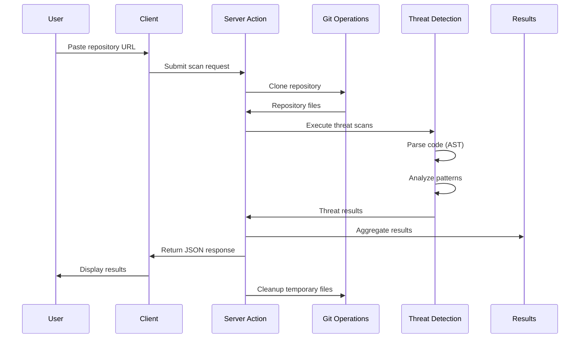
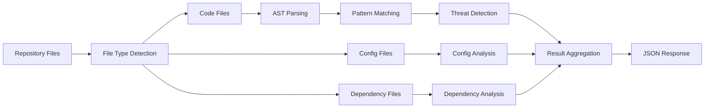

# Data Flow Architecture

## Repository Scanning Flow

```mermaid
sequenceDiagram
    participant U as User
    participant C as Client
    participant S as Server Action
    participant G as Git Operations
    participant T as Threat Detection
    participant R as Results

    U->>C: Paste repository URL
    C->>S: Submit scan request
    S->>G: Clone repository
    G->>S: Repository files
    S->>T: Execute threat scans
    T->>T: Parse code (AST)
    T->>T: Analyze patterns
    T->>S: Threat results
    S->>R: Aggregate results
    S->>C: Return JSON response
    C->>U: Display results
    S->>G: Cleanup temporary files
```

## Threat Detection Pipeline

```mermaid
graph LR
    A[Repository Files] --> B[File Type Detection]
    B --> C[Code Files]
    B --> D[Config Files]
    B --> E[Dependency Files]
    
    C --> F[AST Parsing]
    F --> G[Pattern Matching]
    G --> H[Threat Detection]
    
    D --> I[Config Analysis]
    E --> J[Dependency Analysis]
    
    H --> K[Result Aggregation]
    I --> K
    J --> K
    K --> L[JSON Response]
```
