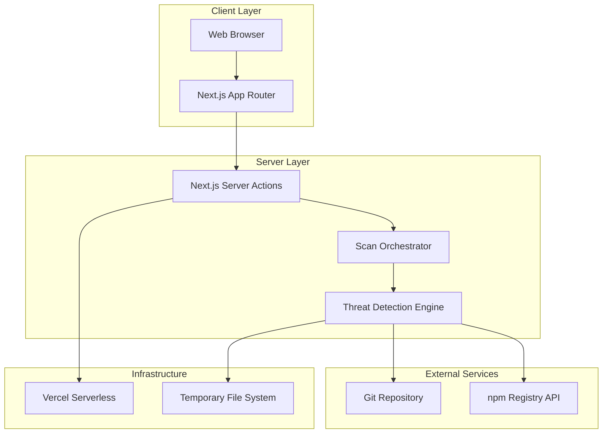

# System Architecture

## High-Level Architecture

## Core Components

**1. Client Layer**
- Single-page React application with Next.js App Router
- Dark theme UI using Tailwind CSS and Fira Mono font
- Repository URL input form and adaptive results display
- Responsive design for desktop and mobile devices

**2. Server Layer**
- Next.js server actions handling scanning operations
- Scan orchestrator coordinating multi-step threat detection
- Individual threat detection modules for each security category
- Result aggregation and JSON formatting

**3. External Integrations**
- Git operations using simple-git library
- npm registry API for dependency analysis
- No authentication or external security services required

**4. Infrastructure**
- Next.js backend deployment (Vercel, Netlify, or custom hosting)
- Temporary file system for repository cloning
- Automatic cleanup after each scan
