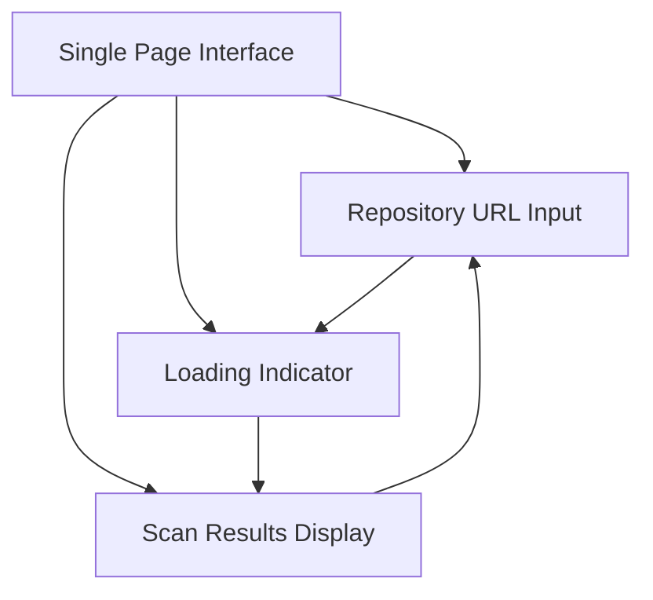
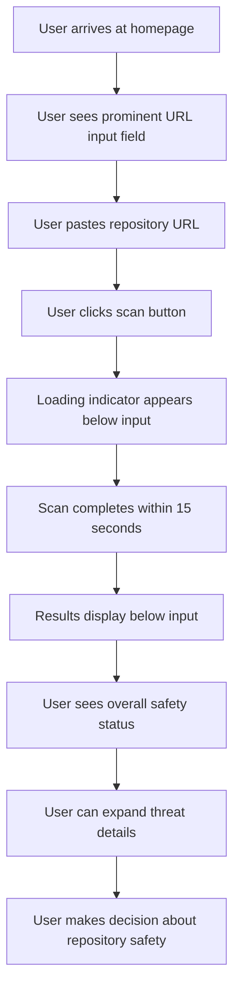

# repoHack UI/UX Specification

## Introduction

This document defines the user experience goals, information architecture, user flows, and visual design specifications for repoHack's user interface. It serves as the foundation for visual design and frontend development, ensuring a cohesive and user-centered experience.

### Overall UX Goals & Principles

**Target User Personas:**
- **Security-Conscious Developer:** Developers who prioritize safety and need quick threat assessment
- **Job Seeker Under Pressure:** Developers applying to jobs who need to quickly verify repository safety
- **Recruiter Scam Victim:** Developers who have been targeted and need protection tools

**Usability Goals:**
- **Speed:** Complete security assessment within 15 seconds
- **Clarity:** Immediate understanding of repository safety status
- **Trust:** Confidence in scan results and threat detection accuracy
- **Simplicity:** One-click scanning with clear, actionable results

**Design Principles:**
1. **Security First** - Every design decision prioritizes user safety and threat awareness
2. **Developer-Centric** - Interface feels like a professional development tool
3. **Progressive Disclosure** - Show safety status first, then detailed threat breakdown
4. **Immediate Feedback** - Clear visual indicators for all security states
5. **Minimalist Trust** - Clean, focused design that builds confidence

**Change Log:**
| Date | Version | Description | Author |
|------|---------|-------------|---------|
| [Current Date] | v1.0 | Initial UX specification creation | UX Expert |

## Information Architecture (IA)

**Site Map / Screen Inventory:**


**Navigation Structure:**
- **Primary Navigation:** Single-page application with no navigation elements
- **Secondary Navigation:** None - all content appears below the input field
- **Breadcrumb Strategy:** No breadcrumbs - single page flow

## User Flows

**Primary User Flow: Repository Security Scan**

**User Goal:** Quickly assess repository safety before running potentially malicious code

**Entry Points:** 
- Direct URL access to the homepage
- Repository URL shared via link

**Success Criteria:** 
- User receives clear safety assessment within 15 seconds
- User understands whether repository is safe to run
- User can access detailed threat information if needed

**Flow Diagram:**


**Edge Cases & Error Handling:**
- Invalid repository URL format
- Private repository access denied
- Network timeout during scanning
- Repository too large for scanning
- Scan failure or error

**Notes:** This flow emphasizes the single-page experience with all content appearing below the input field. The loading state provides immediate feedback, and results appear in the same view for seamless user experience.

## Wireframes & Mockups

**Primary Design Files:** 
Based on the PRD requirements, I recommend using **Figma** for creating the detailed visual designs, as it provides excellent collaboration features and design system capabilities for the component library.

**Key Screen Layouts:**

**Screen: Single Page Interface**
- **Purpose:** Complete repository scanning experience in one view
- **Key Elements:**
  - Large, centered repository URL input field
  - Prominent scan button below input
  - Loading indicator that appears below input during scan
  - Results display that replaces loading indicator when complete
  - Overall safety status prominently displayed at top of results
  - Expandable threat details below safety status
- **Interaction Notes:** All content appears below the input field, creating a natural vertical flow. Loading state provides immediate feedback, and results maintain the same positioning for seamless experience.
- **Design File Reference:** Main Figma file with component library and responsive layouts

## Component Library / Design System

**Design System Approach:** 
Based on the PRD requirements for a minimalist, developer-focused interface, I recommend creating a **custom design system** specifically for repoHack rather than using an existing one. This allows us to maintain the unique security tool aesthetic while ensuring consistency across all components.

**Core Components:**

**Component: Repository URL Input**
- **Purpose:** Primary user interaction point for entering repository URLs
- **Variants:** Default state, focus state, error state, loading state
- **States:** Empty, filled, invalid, submitting
- **Usage Guidelines:** Large, prominent placement with clear validation feedback

**Component: Scan Button**
- **Purpose:** Triggers the security scanning process
- **Variants:** Default, hover, active, disabled
- **States:** Ready, loading, completed, error
- **Usage Guidelines:** High contrast button that clearly indicates action

**Component: Loading Indicator**
- **Purpose:** Shows scan progress and maintains user engagement
- **Variants:** Initial loading, progress indication, completion
- **States:** Starting, scanning, processing, finishing
- **Usage Guidelines:** Simple, non-intrusive animation that appears below input

**Component: Safety Status Display**
- **Purpose:** Immediately communicates repository safety level
- **Variants:** Safe (green), Warning (yellow), Unsafe (red)
- **States:** Loading, safe, warning, unsafe, error
- **Usage Guidelines:** Large, prominent display with clear color coding

**Component: Threat Detail Accordion**
- **Purpose:** Allows users to drill down into specific security findings
- **Variants:** Collapsed, expanded, with threat count badges
- **States:** Closed, open, loading details
- **Usage Guidelines:** Progressive disclosure pattern for detailed information

## Branding & Style Guide

**Visual Identity:**
**Brand Guidelines:** Based on the PRD requirement for "No Branding - Pure functional design without logos or brand elements," repoHack will use a **minimalist, developer-tool aesthetic** that prioritizes functionality over visual branding.

**Color Palette:**
| Color Type | Hex Code | Usage |
|------------|----------|-------|
| Primary | #3B82F6 (Blue-500) | Interactive elements, status indicators, focus states |
| Secondary | #1E40AF (Blue-700) | Hover states, secondary actions |
| Accent | #60A5FA (Blue-400) | Subtle highlights, progress indicators |
| Success | #10B981 (Emerald-500) | Safe repository status, positive feedback |
| Warning | #F59E0B (Amber-500) | Warning status, caution indicators |
| Error | #EF4444 (Red-500) | Unsafe repository status, error messages |
| Neutral | #1F2937 to #F9FAFB | Text, borders, backgrounds (gray scale) |

**Typography:**
- **Primary:** Fira Mono (monospace) - Main interface text, code elements
- **Secondary:** Inter (sans-serif) - Headings, labels, UI text
- **Monospace:** Fira Mono - Code snippets, technical information

**Type Scale:**
| Element | Size | Weight | Line Height |
|---------|------|--------|-------------|
| H1 | 2.25rem (36px) | 700 | 1.2 |
| H2 | 1.875rem (30px) | 600 | 1.3 |
| H3 | 1.5rem (24px) | 600 | 1.4 |
| Body | 1rem (16px) | 400 | 1.6 |
| Small | 0.875rem (14px) | 400 | 1.5 |

**Iconography:**
**Icon Library:** Lucide React (open-source, consistent with minimalist aesthetic)
**Usage Guidelines:** Simple, functional icons with consistent stroke width. Use sparingly to maintain clean interface.

**Spacing & Layout:**
**Grid System:** 8px base unit system using Tailwind CSS spacing scale
**Spacing Scale:** 4px, 8px, 16px, 24px, 32px, 48px, 64px for consistent component spacing

## Accessibility Requirements

**Note:** Accessibility requirements are skipped for MVP as per project requirements. Focus is on core functionality and user experience.

## Responsiveness Strategy

**Breakpoints:**
| Breakpoint | Min Width | Max Width | Target Devices |
|------------|-----------|-----------|----------------|
| Mobile | 320px | 767px | Smartphones, small tablets |
| Tablet | 768px | 1023px | Tablets, small laptops |
| Desktop | 1024px | 1439px | Laptops, desktop monitors |
| Wide | 1440px | - | Large monitors, high-res displays |

**Adaptation Patterns:**
**Layout Changes:** Single column layout on mobile, centered content with appropriate margins. Input field and button stack vertically on small screens.
**Navigation Changes:** No navigation changes needed for single-page design
**Content Priority:** Safety status remains prominent, threat details stack vertically on mobile
**Interaction Changes:** Touch-friendly button sizes on mobile, appropriate input field sizing for different devices

## Animation & Micro-interactions

**Motion Principles:**
**Tailwind-First Animation** - Leverage Tailwind CSS built-in animation utilities and extend with custom animations where needed. All animations serve functional purposes while maintaining the security tool's professional aesthetic.

**Key Animations:**

- **Loading State Transition:** `animate-fade-in` with `transition-all duration-300 ease-out` (Tailwind utilities)
- **Results Appearance:** `animate-slide-down` with `transition-all duration-400 ease-out` (Custom Tailwind extension)
- **Status Color Transitions:** `transition-colors duration-200 ease-in-out` (Native Tailwind)
- **Accordion Expansion:** `transition-all duration-250 ease-out` with height animation (Tailwind + custom)
- **Button State Changes:** `hover:scale-105 transition-transform duration-150 ease-out` (Native Tailwind)

**Tailwind Extension Approach:**
Create custom animations in `tailwind.config.js` for repoHack-specific transitions:
```javascript
// Custom animations for security tool interactions
extend: {
  animation: {
    'fade-in': 'fadeIn 0.3s ease-out',
    'slide-down': 'slideDown 0.4s ease-out',
    'status-pulse': 'statusPulse 2s ease-in-out infinite'
  }
}
```

## Performance Considerations

**Performance Goals:**
- **Page Load:** Initial page load under 2 seconds for optimal user experience
- **Interaction Response:** Button clicks and form interactions respond within 100ms
- **Animation FPS:** Smooth 60fps animations for professional feel

**Design Strategies:**
**Optimized Asset Loading** - Minimal external dependencies, optimized Tailwind CSS output, and efficient icon loading using Lucide React's tree-shaking capabilities.

## Next Steps

**Immediate Actions:**
1. **Stakeholder Review** - Present this specification to development team and stakeholders for feedback
2. **Design File Creation** - Set up Figma project with component library and responsive layouts
3. **Design Handoff Preparation** - Prepare detailed design specifications for frontend development
4. **Component Documentation** - Create detailed component specifications with states and variants
5. **Responsive Design Validation** - Test layouts across different device sizes and orientations

**Design Handoff Checklist:**
- [x] All user flows documented
- [x] Component inventory complete
- [x] Accessibility requirements defined (skipped for MVP)
- [x] Responsive strategy clear
- [x] Brand guidelines incorporated
- [x] Performance goals established

**Next Phase Recommendations:**
1. **Visual Design Creation** - Develop high-fidelity mockups in Figma using the established design system
2. **Frontend Architecture Handoff** - Collaborate with Design Architect for technical implementation
3. **Component Development** - Begin building the component library in Next.js with Tailwind CSS
4. **User Testing Preparation** - Plan testing scenarios for the security scanning interface

**Open Questions & Decisions Needed:**
- Final approval of color palette and typography choices
- Confirmation of single-page layout approach
- Validation of component hierarchy and interaction patterns
- Agreement on Tailwind animation extension approach

---

*This UI/UX specification serves as the foundation for creating repoHack's professional, trustworthy interface that protects developers from malicious repositories while maintaining the clean, minimalist aesthetic specified in the project requirements.*
